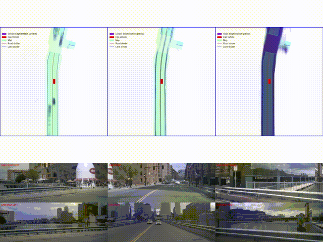

# LSS_reproduction

## Contribution

Based on the [LSS](https://github.com/nv-tlabs/lift-splat-shoot) (Lift, Splat, Shoot) algorithm, an extension was made to simultaneously detect vehicles, vehicle-road interactions, lane lines, and segmentation parts of the road, resulting in slightly improved performance compared to what was reported in the [paper](https://arxiv.org/abs/2008.05711).

基于[LSS](https://github.com/nv-tlabs/lift-splat-shoot) (Lift, Splat, Shoot)算法，增加了同时检测车辆、道路与车辆、车道线、道路的分割部分。并获得了比[论文](https://arxiv.org/abs/2008.05711)中提到的稍好的效果。


## Quikly start

```shell
git clone https://github.com/byx020119/LSS_reproduction.git

cd LSS_reproduction

python main.py viz_model_preds mini --modelf=MODEL_ROOT --dataroot=NUSCENES_ROOT --map_folder=MAP_FOLDER_ROOT  --outC=CLASS_NUMBER --gpuid=GPU_ID
```
annotations: outC=class number

default:
- outC=1:vehicle
- outC=2:vehicle and road
- outC=3:vehicle, divider and road

## Demo



## Citation

```
@inproceedings{philion2020lift,
    title={Lift, Splat, Shoot: Encoding Images From Arbitrary Camera Rigs by Implicitly Unprojecting to 3D},
    author={Jonah Philion and Sanja Fidler},
    booktitle={Proceedings of the European Conference on Computer Vision},
    year={2020},
}
```